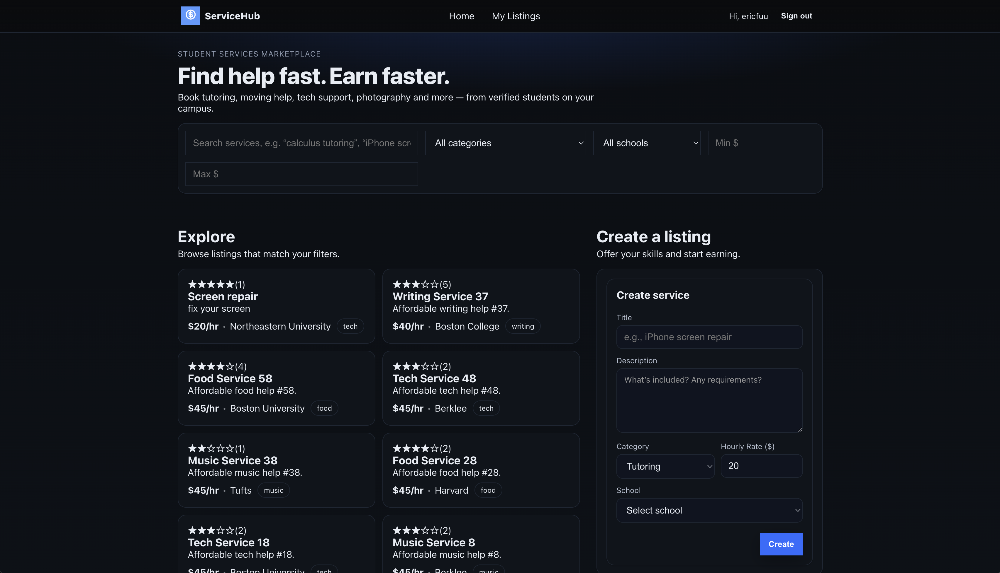
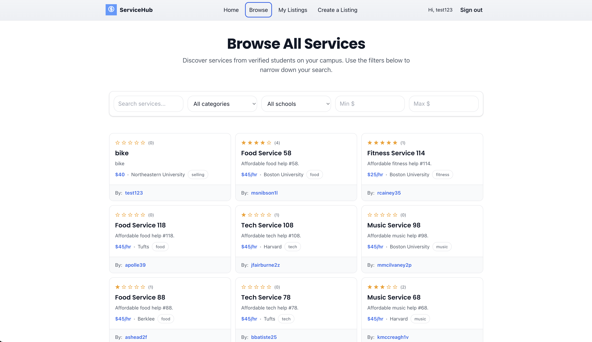
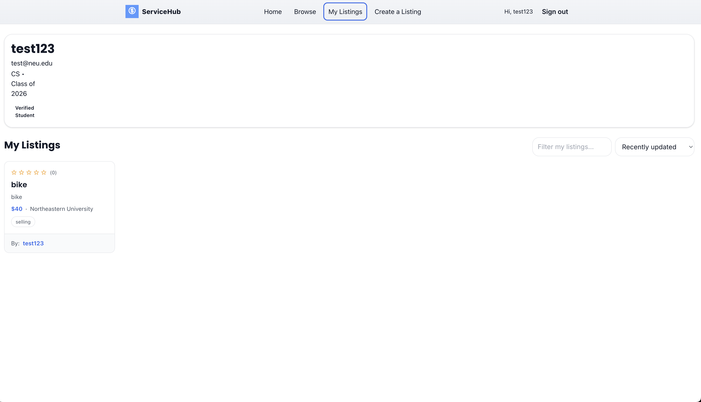
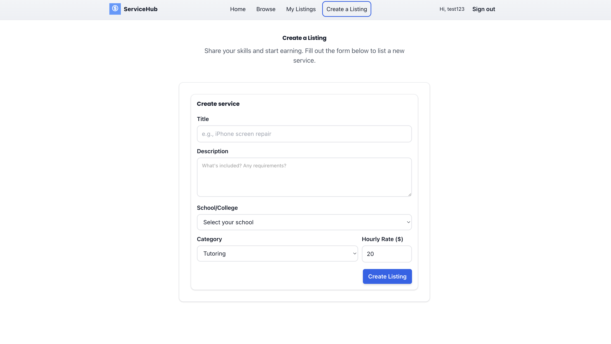
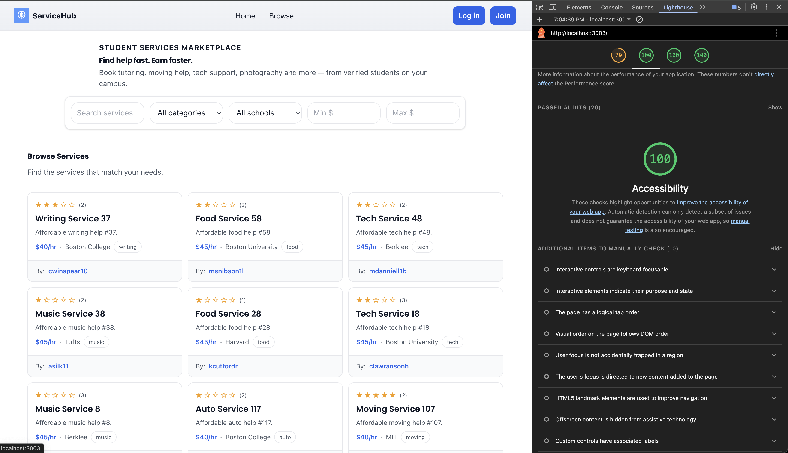
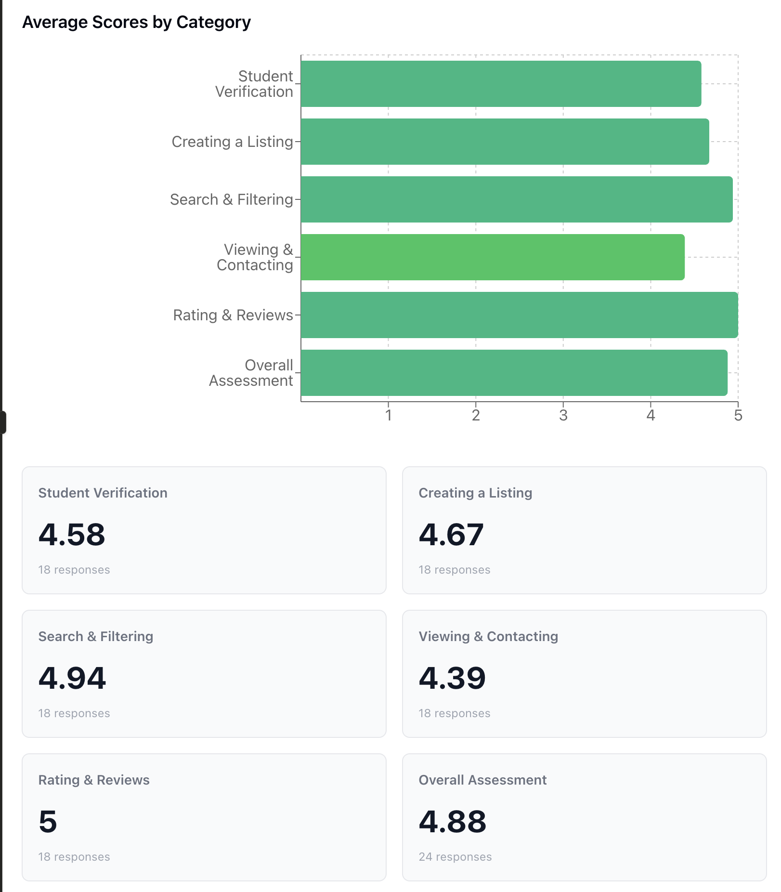

# ServiceHub

**A Student Services Marketplace for Campus Communities**

---

## 👥 Authors

- **Eric Fu** - [GitHub](https://github.com/ericfu4)
- **Brandan Yong** - [GitHub](https://github.com/byong821)

---

## 🎓 Class Information

**Course:** CS5610 - Web Development (Fall 2025)  
**Institution:** Northeastern University  
**Class Link:** [CS5610 Web Development Online](https://johnguerra.co/classes/webDevelopment_online_fall_2025/)

---

## 🎯 Project Objective

ServiceHub is a full-stack web application designed to connect students on campus who need services with students who can provide them. The platform enables students to:

- **Browse and search** for student-provided services across multiple categories
- **Filter services** by category, school location, and price range
- **Create listings** to offer their own skills and services
- **Leave reviews** and ratings for completed services
- **Manage their listings** through a personalized profile dashboard

The goal is to create a trusted, student-only marketplace that makes it easy to find help with tutoring, moving, tech support, photography, and more—all within the campus community.

**Live Demo:** [ServiceHub on Render](https://servicehub-06p9.onrender.com)

---

## 📸 Screenshots

### Home Page - Service Discovery



### Browse Services 



### My Listings - Manage Your Services



### Create a Listing 


### Lighthouse Report


---

## 🎬 Video Demo

**Duration:** ~5 minutes  
**Link:** [ServiceHub Demo on YouTube](https://youtu.be/Wk3z3jF6QTQ)

---

## Usability Report 
**Link:** [Usability Report Document](https://northeastern-my.sharepoint.com/:w:/g/personal/fu_er_northeastern_edu/IQA61-iu1am0QospmtgsGhm9ARxfDyyfDkr2BbOffYZg70w?e=5aEWyd)

### Post-Test Likert Questionnaire Responses


## 🛠️ Technology Stack

**Frontend:**

- React 18 with Hooks
- React Router v7 for client-side routing
- Modern CSS3 with CSS Variables and Flexbox/Grid
- Responsive design (mobile-first approach)

**Backend:**

- Node.js runtime
- Express.js web framework
- MongoDB with native driver
- Express-session for authentication
- bcrypt for password hashing

**Database:**

- MongoDB Atlas (cloud)
- 2+ collections with CRUD operations
- 1000+ synthetic records for testing

**Deployment:**

- Frontend & Backend: Render
- Database: MongoDB Atlas

---

## ✨ Key Features

- ✅ **User Authentication** - Secure register, login, and logout with sessions
- ✅ **Service Listings** - Create, read, update, and delete service listings
- ✅ **Search & Filter** - Find services by keywords, category, school, and price
- ✅ **Service Details** - View comprehensive service information and provider details
- ✅ **Reviews & Ratings** - Leave reviews with star ratings (5-star system)
- ✅ **User Profiles** - Manage your listings and profile information
- ✅ **Responsive Design** - Works on mobile, tablet, and desktop
- ✅ **Accessible UI** - Keyboard navigation, ARIA labels, semantic HTML
- ✅ **Input Validation** - Client and server-side validation
- ✅ **Error Handling** - Graceful error messages and recovery

---

## 📦 Project Structure

```
ServiceHub/
├── backend/                 # Express.js API
│   ├── models/              # Database schemas
│   │   ├── users.js
│   │   ├── services.js
│   │   └── reviews.js
│   ├── routes/              # API route handlers
│   │   ├── auth.js
│   │   ├── users.js
│   │   ├── services.js
│   │   └── reviews.js
│   ├── middleware/          # Express middleware
│   │   └── auth.js
│   ├── utils/               # Utilities
│   │   ├── db.js            # Database connection
│   │   └── createIndexes.js
│   ├── seed/                # Database seeding
│   │   ├── index.js
│   │   ├── seedUsers.js
│   │   ├── seedServices.js
│   │   ├── seedReviews.js
│   │   └── data/            # Seed data
│   │       ├── users.json
│   │       ├── reviews.json
│   ├── .env                 # Environment variables (git-ignored)
│   ├── .eslintrc.json       # ESLint configuration
│   ├── .prettierrc.json     # Prettier configuration
│   ├── package.json
│   └── server.js            # Express server entry point
├── frontend/                # React app
│   ├── public/              # Static files
│   │   ├── index.html
│   │   └── favicon.png
│   ├── src/
│   │   ├── components/      # Reusable components
│   │   │   ├── Header.jsx
│   │   │   ├── Header.css
│   │   │   ├── ServiceCard.jsx
│   │   │   ├── ServiceCard.css
│   │   │   ├── ReviewCard.jsx
│   │   │   ├── Loading.jsx
│   │   │   ├── Loading.css
│   │   │   └── ErrorBoundary.jsx
│   │   ├── pages/           # Page components
│   │   │   ├── Home.jsx
│   │   │   ├── Home.css
│   │   │   ├── Login.jsx
│   │   │   ├── Login.css
│   │   │   ├── Register.jsx
│   │   │   ├── Register.css
│   │   │   ├── ServiceList.jsx
│   │   │   ├── ServiceList.css
│   │   │   ├── ServiceForm.jsx
│   │   │   ├── ServiceForm.css
│   │   │   ├── ServiceDetail.jsx
│   │   │   ├── ServiceDetail.css
│   │   │   ├── ReviewsList.jsx
│   │   │   ├── ReviewsList.css
│   │   │   ├── Profile.jsx
│   │   │   ├── Profile.css
│   │   │   ├── BrowseServices.jsx
│   │   │   ├── BrowseServices.css
│   │   │   ├── CreateListing.jsx
│   │   │   ├── CreateListing.css
│   │   │   ├── ProviderProfile.jsx
│   │   │   ├── ProviderProfile.css
│   │   ├── context/         # React context (auth)
│   │   │   └── authContext.jsx
│   │   ├── services/        # API client
│   │   │   └── api.js
│   │   ├── styles/          # Global styles
│   │   │   └── variables.css
│   │   ├── App.js
│   │   ├── App.css
│   │   ├── index.js
│   │   ├── index.css
│   ├── .env                 # Environment variables (git-ignored)
│   ├── .eslintrc.json       # ESLint configuration
│   ├── .prettierrc.json     # Prettier configuration
│   ├── package.json
├── .eslintrc.json           # Root ESLint config
├── .prettierrc.json         # Root Prettier config
├── LICENSE                  # MIT License
└── README.md
```

---

## 🚀 Getting Started

### Prerequisites

- **Node.js** v18+ ([download](https://nodejs.org/))
- **MongoDB** (either [local](https://docs.mongodb.com/manual/installation/) or [Atlas account](https://www.mongodb.com/cloud/atlas))
- **Git**

### Installation & Setup

#### 1. Clone the Repository

```bash
git clone https://github.com/byong821/ServiceHub.git
cd ServiceHub
```

#### 2. Backend Setup

```bash
cd backend

# Install dependencies
npm install

# Create .env file from example
cp .env.example .env

# Edit .env and configure:
# - MONGODB_URI: Your MongoDB connection string
# - SESSION_SECRET: A random secret string for sessions
# - PORT: 5001 (default)

# Seed database with 400+ users and 600+ services
npm run seed

# Start the backend server
npm start
```

**Backend runs on:** `http://localhost:5001`

#### 3. Frontend Setup

```bash
# Open a NEW terminal window
cd frontend

# Install dependencies
npm install

# Start the development server
npm start
```

**Frontend runs on:** `http://localhost:3000`  
_Note: The React app will automatically proxy API requests to the backend_

#### 4. Access the Application

```
http://localhost:3000
```

---

## 👤 Demo Accounts

After running `npm run seed`, you can login with:

- **Any seeded user**
- **Password:** `password123` (for all seeded accounts)
- **Or register a new account**

---

## 🔒 Security Features

- ✅ **Password Hashing** - bcrypt with salt rounds
- ✅ **Session-based Auth** - Express-session with secure cookies
- ✅ **CSRF Protection** - Session validation
- ✅ **No Exposed Secrets** - All credentials in `.env` (git-ignored)
- ✅ **Input Validation** - Server-side validation for all inputs
- ✅ **HTTPS Ready** - Deployment on Render with HTTPS

---

## ♿ Accessibility

ServiceHub is designed with accessibility in mind:

- ✅ **Keyboard Navigation** - All features accessible via keyboard
- ✅ **ARIA Labels** - Semantic HTML with proper ARIA attributes
- ✅ **Semantic HTML** - Proper use of `<button>`, `<nav>`, `<main>`, `<section>`, etc.
- ✅ **Focus Indicators** - Visible focus states for interactive elements
- ✅ **Color Contrast** - Meeting WCAG AA standards
- ✅ **Screen Reader Support** - Tested with screen readers

**Run Accessibility Tests:**

```bash
# Frontend accessibility audit
npm run audit

# Or use Lighthouse in Chrome DevTools
# - Open DevTools (F12)
# - Go to "Lighthouse" tab
# - Run accessibility audit
```

---

## 💾 Database

### Collections

**users** - User accounts and profiles

```javascript
{
  _id: ObjectId,
  username: String,
  email: String (unique),
  password: String (hashed),
  major: String,
  gradYear: Number,
  createdAt: Date,
  updatedAt: Date
}
```

**services** - Service listings

```javascript
{
  _id: ObjectId,
  title: String,
  description: String,
  category: String,
  hourlyRate: Number,
  location: String,
  providerId: ObjectId (ref: users),
  providerName: String,
  providerEmail: String,
  createdAt: Date,
  updatedAt: Date
}
```

**reviews** - Service reviews and ratings

```javascript
{
  _id: ObjectId,
  serviceId: ObjectId (ref: services),
  providerId: ObjectId (ref: users),
  reviewerId: ObjectId (ref: users),
  rating: Number (1-5),
  comment: String,
  providerResponse: String,
  createdAt: Date
}
```

### Seeded Data

The database includes:

- **400+ users** with realistic profiles
- **600+ services** across 15 categories
- **1000+ reviews** with ratings (1-5 stars)

Run seeding: `npm run seed` in the `backend` directory

---

## 📋 Development Workflow

### Code Quality

- **ESLint** - Linting configuration for consistent code style
- **Prettier** - Code formatting (auto-format on save)

Run checks:

```bash
# Lint code
npm run lint

# Format code
npm run format
```

### Component Architecture

- **Functional Components** - React Hooks (useState, useEffect, useContext)
- **PropTypes** - Type checking for all components
- **CSS Modules** - Organized styles per component
- **Error Boundary** - Graceful error handling

---

## 📄 License

This project is licensed under the **MIT License** - see the [LICENSE](./LICENSE) file for details.

---

## 🤝 Contributing

Contributions are welcome! Please feel free to submit pull requests or open issues.

---

## 📞 Support

For questions or issues, please:

1. Check the [Issues](https://github.com/byong821/ServiceHub/issues) page
2. Contact: [Eric Fu](https://github.com/ericfu4) or [Brandan Yong](https://github.com/byong821)

---

**Built with ❤️ for CS5610 - Web Development**
